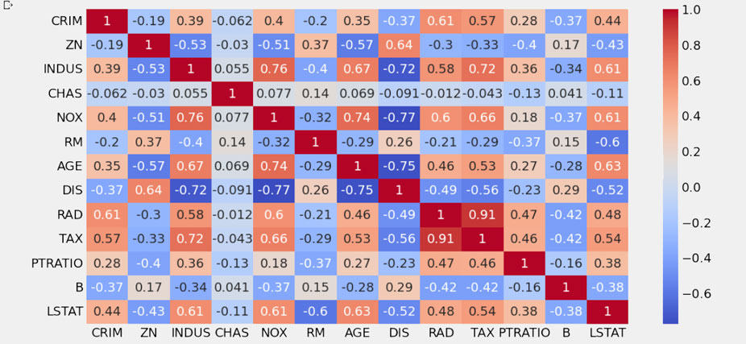

# Machine learning regression basics

#### -- Project Status: [Active]

## Objective
Set the ML foundations by understanding how to prepare data, which models to test for a given task and the different metrics needed to assess for a given problem.

### Notebooks
* [housing_data_regression_analysis](housing_data_regression_analysis.ipynb)

### Data and sources
* [Scikit-learn housing dataset]([https://X](https://github.com/scikit-learn/scikit-learn/blob/main/sklearn/datasets/data/boston_house_prices.csv)https://github.com/scikit-learn/scikit-learn/blob/main/sklearn/datasets/data/boston_house_prices.csv)

### Technologies and packages
* Sklearn
